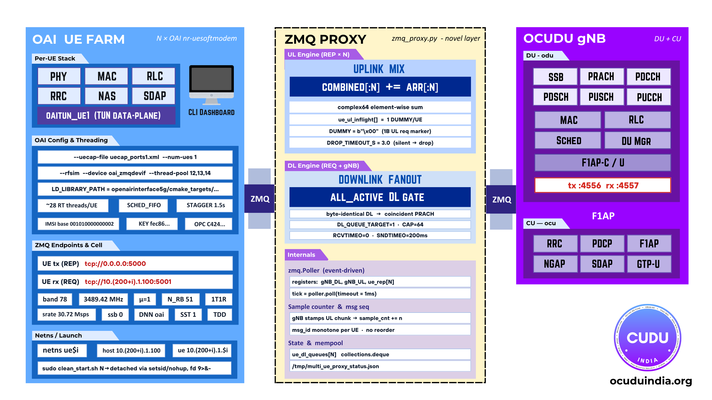
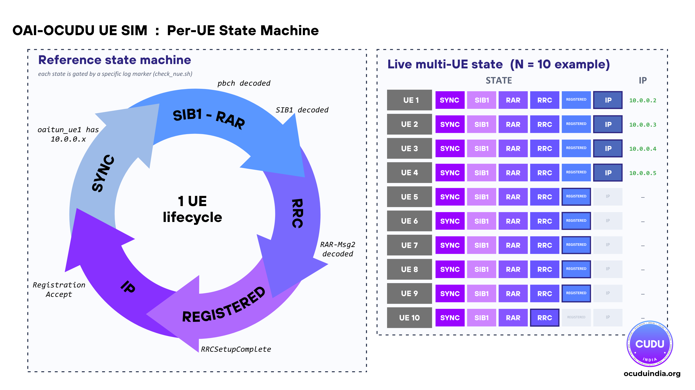

# Multi-UE Simulation

A self-contained harness for the **OCUDU RAN Stack** that runs **N OAI `nr-uesoftmodem` instances** against a single gNB over ZMQ, each UE isolated in its own Linux network namespace, driven by a Rust terminal dashboard.

## Architecture



## Per-UE lifecycle



## What's in here

| Path | Purpose |
|---|---|
| `multi_ue_sim/proxy/zmq_proxy.py` | Single-thread ZMQ DL/UL proxy multiplexing one gNB onto N UEs (lockstep, backpressure, wave admission, live-add) |
| `multi_ue_sim/dashboard/` | `ue-sim` Rust CLI + ratatui TUI (start/stop/status/traffic/logs/monitor) |
| `multi_ue_sim/traffic/ue_traffic.py` | Per-UE traffic engine (idle / speedtest / video / gaming) |
| `multi_ue_sim/run_nue.sh` | Provisions netns + veth pairs, launches proxy and N UEs |
| `multi_ue_sim/clean_start.sh` | End-to-end: kill leftovers → CU → DU → UEs |
| `multi_ue_sim/mue_add.sh` | Hot-add a UE at runtime |
| `multi_ue_sim/provision_subscribers.sh` | Bulk-insert IMSIs into the 5GC `oai_db` |
| `multi_ue_sim/config/gen_ue_config.py` | Generate multi-UICC OAI UE config |

## Quick start

```bash
# 1. Build the dashboard
cd multi_ue_sim/dashboard && cargo build --release && cd -

# 2. Provision N subscribers in the 5GC (once)
bash multi_ue_sim/provision_subscribers.sh 10

# 3. Start gNB + N UEs in one shot
sudo bash multi_ue_sim/clean_start.sh 10

# 4. Open the dashboard
sudo ./multi_ue_sim/dashboard/target/release/ue-sim monitor

# Stop everything
sudo bash multi_ue_sim/run_nue.sh 10 --stop
```

## Requirements

- OAI `nr-uesoftmodem` built at `cmake_targets/nr-uesoftmodem`
- A gNB (OCUDU split or monolithic) reachable on ZMQ `tcp://127.0.0.1:4556` / `:4557`
- OAI 5G Core with the `mysql` container running
- Python 3 with `pyzmq` and `numpy`
- Root access (for network namespaces and `iptables`)
- Rust toolchain (for building the dashboard)

## Documentation

- **Dashboard user guide:** [`multi_ue_sim/docs/DASHBOARD_GUIDE.md`](multi_ue_sim/docs/DASHBOARD_GUIDE.md)
- **Full documentation:** <https://docs.ocuduindia.org/docs/multi-ue-sim/>
