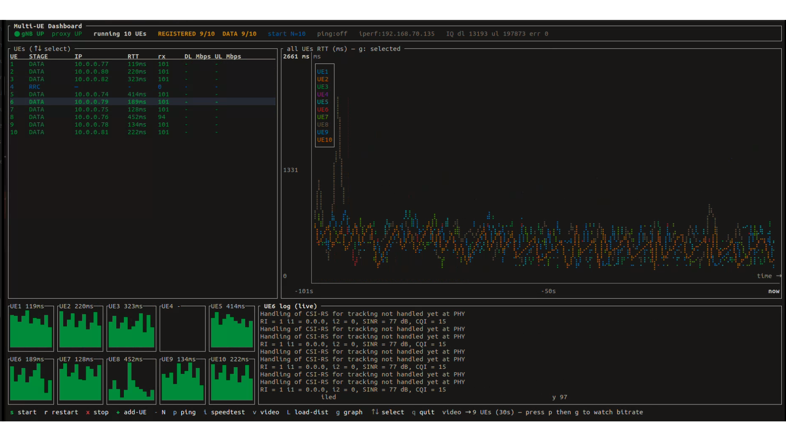

# Multi-UE Simulation - Dashboard User Guide

> A terminal-based control panel for running, monitoring, and testing multiple OAI UEs simultaneously over a ZMQ-connected gNB.

<p align="center">
  
</p>

---

## 1. Prerequisites

| Item | Detail |
|---|---|
| OAI `nr-uesoftmodem` | Built at `cmake_targets/nr-uesoftmodem` |
| OAI gNB | Started **manually** before pressing `s` |
| OAI 5G Core | `mysql` Docker container must be up |
| Python 3 + pyzmq | `pip3 install pyzmq` |
| Root access | Required for network namespaces |

---

## 2. Build the Dashboard Binary

```bash
cd multi_ue_sim/dashboard
cargo build --release
```

Binary is at: `multi_ue_sim/dashboard/target/release/ue-sim`

---

## 3. Provision Subscribers (once)

Insert UE identities into the 5G Core database before the first run:

```bash
cd multi_ue_sim
bash provision_subscribers.sh 10          # for 10 UEs
bash provision_subscribers.sh 10 --list   # verify entries
```

Default credentials: `IMSI_BASE=001010000000002`, `KEY=fec86ba6eb707ed08905757b1bb44b8f`, `OPC=C42449363BBAD02B66D16BC975D77CC1`

Override with env vars:
```bash
IMSI_BASE=001010000000010 MYSQL_PW=mypassword bash provision_subscribers.sh 5
```

---

## 4. Start the gNB

Start your OCUDU (or monolithic) gNB **manually**. The dashboard detects it by probing TCP port 4556 - no specific binary name is assumed.

The header bar will show:
- `gNB UP` - port 4556 is bound, safe to start UEs
- `gNB DOWN` - gNB not ready; pressing `s` will show an error

---

## 5. Open the Dashboard

The primary command to open the full interactive TUI is:

```bash
./dashboard/target/release/ue-sim monitor
```

Or with an explicit UE count:

```bash
./dashboard/target/release/ue-sim monitor --num-ues 10
```

If `--num-ues` is omitted the dashboard reads the last-used count from `/tmp/run_nue.n`.

The TUI opens fullscreen in the terminal. Press `q` or `Esc` to quit (UEs stop automatically on quit).

> `ue-sim status --watch` is a lighter read-only view. Use `monitor` for the full dashboard with all controls (start/stop, traffic tests, live charts).

---

## 6. Dashboard Layout

The dashboard is divided into four regions:

### Header bar

Shows gNB readiness and proxy status side by side. In ZMQ mode the proxy reports DL/UL frame counts and total errors in real time.

### UE Status table (left panel)

| Column | Meaning |
|---|---|
| `#` | UE index |
| `IP Address` | Tunnel IP assigned by 5GC (e.g. `12.1.1.2`) |
| `Status` | Registration stage - colour-coded (see section 7) |
| `Pattern` | Active traffic pattern (`idle` / `speedtest` / `video` / `gaming`) |
| `DL Mbps` | Downlink throughput measured at the UE tunnel |
| `UL Mbps` | Uplink throughput |
| `Lat ms` | Round-trip latency to the data-plane gateway |

Use `↑` / `↓` to move the selection. The right panel shows full detail for the selected UE.

### Log panel (right panel, bottom)

Tails the active log file in real time. Press `Tab` to cycle through:
- **proxy.log** - ZMQ proxy frame counts, wave admission events
- **nr-ue.log** - OAI UE softmodem output (PBCH, SIB1, RACH, RRC, NAS)
- **traffic.log** - per-UE traffic engine events

`PgUp` / `PgDn` scroll history. `End` jumps back to live tail.

### Sparkline chart (bottom strip)

One coloured sparkline per UE showing the last 60 seconds of the selected metric. Press `g` to cycle chart modes.

---

## 7. UE Registration Stages

Each UE progresses through these stages, shown colour-coded in the Status column:

| Stage | Colour | Meaning |
|---|---|---|
| `--` | Grey | Not started / no log yet |
| `SYNC` | Purple | Detected SSB / PBCH decoded |
| `SIB1` | Amber | System Information received |
| `RAR` | Sky blue | Random Access Response (Msg2) received |
| `RRC` | Deep blue | RRC Setup complete |
| `REGISTERED` | Dark green | 5GC registration accepted (control plane only) |
| `DATA` | Forest green | PDU session up - tunnel IP assigned, data plane active |

A UE showing `SYNC` after previously reaching `DATA` has lost radio sync and is re-establishing. This is normal under high CPU load.

---

## 8. Keyboard Reference

### Simulation control

| Key | Action |
|---|---|
| `s` | **Start / restart** N UEs (gNB must be UP) |
| `r` | **Restart** UEs (same as `s`) |
| `x` | **Stop** all UEs and proxy |
| `+` / `=` | Increase UE count (before start) or **add one UE live** (after start) |
| `-` / `_` | Decrease UE count (before start only) |

### Traffic and measurement

| Key | Action |
|---|---|
| `p` | Toggle **ping** on all UEs (ICMP RTT, shown in sparklines) |
| `i` | **Speed-test** - iperf3 TCP downlink to each UE (~65 s DL+UL) |
| `v` | **Video** traffic - CBR iperf3 UDP simulation (30 s) |
| `l` / `L` | Toggle **load distribution** - pings all UEs, focus cycles every 5 s |
| `g` | Cycle **chart metric**: Avg RTT -> All RTT -> Selected RTT -> Bitrate |

> `i` and `v` require `IPERF_SRV` env var set to the ext-dn container IP.
> UEs must be at `DATA` stage for traffic tests to run.

### Log viewer

| Key | Action |
|---|---|
| `Tab` | Cycle log source: proxy -> nr-ue -> traffic |
| `[` / `]` | Previous / next individual UE log (rfsim mode) |
| `↑` / `↓` | Select UE in table |
| `PgUp` | Scroll log up 10 lines |
| `PgDn` | Scroll log down 10 lines |
| `End` | Jump to live tail |

### Exit

| Key | Action |
|---|---|
| `q` / `Esc` | Quit dashboard - **stops all UEs** and cleans up namespaces |
| `Ctrl+C` | Same as `q` |

---

## 9. Running a Speed Test

1. Ensure UEs are at `DATA` stage (green in the table).
2. Export the iperf3 server IP (usually the `oai-ext-dn` container):
   ```bash
   export IPERF_SRV=$(docker inspect -f '{{range.NetworkSettings.Networks}}{{.IPAddress}}{{end}}' oai-ext-dn)
   ```
3. Press `i` inside the dashboard.
4. Watch the `DL Mbps` / `UL Mbps` columns update. Press `p` then `g` (twice) to switch to the Bitrate chart.

The test runs approximately 65 seconds (30 s DL + 30 s UL + overhead). Results persist in the sparkline history after the test ends.

---

## 10. Adding a UE at Runtime

While UEs are running press `+`. The dashboard calls `mue_add.sh` which:
- Creates a new network namespace (`ue<N+1>`)
- Provisions the IMSI in the 5GC database if not already present
- Notifies the proxy of the new UE count
- Launches the UE softmodem in the new namespace

The new UE appears in the table within seconds and progresses through the registration stages independently.

---

## 11. CLI Reference (non-TUI)

```bash
# Start 5 UEs and return to shell (UEs run in background)
sudo ./dashboard/target/release/ue-sim start --num-ues 5

# Check status table (one-shot, no TUI)
./dashboard/target/release/ue-sim status

# Set traffic pattern on UE 3
./dashboard/target/release/ue-sim traffic 3 speedtest

# Tail proxy log
./dashboard/target/release/ue-sim logs --source proxy --follow

# Tail UE 2 log
./dashboard/target/release/ue-sim logs --source ue2 --follow

# Non-TUI monitor loop (prints table every second)
./dashboard/target/release/ue-sim monitor --num-ues 5 --interval-ms 1000

# Stop everything
sudo ./dashboard/target/release/ue-sim stop
```

---

## 12. Key Environment Variables

| Variable | Default | Override example |
|---|---|---|
| `IPERF_SRV` | *(unset)* | `export IPERF_SRV=192.168.70.135` |
| `N_RB` | `51` (20 MHz) | `N_RB=24` for 10 MHz |
| `IMSI_BASE` | `001010000000002` | `IMSI_BASE=001010000000100` |
| `UE_CPUS` | *(unset)* | `UE_CPUS=25-31` |
| `STAGGER_S` | `1.5` | `STAGGER_S=3` (slower attach) |
| `PROXY_WAVE_SIZE` | `1` | `PROXY_WAVE_SIZE=2` |
| `PROXY_WAVE_DELAY_S` | `20` | `PROXY_WAVE_DELAY_S=10` |
| `MULTI_UE_SIM` | *(auto)* | Override script directory |
| `GNB_DL_PORT` | `4556` | `GNB_DL_PORT=4600` |

---

## 13. Troubleshooting

**"gNB is DOWN - start your gNB first"**
The dashboard probes TCP port 4556. Start your gNB, wait for DU to bind ZMQ, then press `s`.

**UEs stuck at SYNC / SIB1 for more than 60 s**
- Check `Tab` -> proxy log for `wave admit` messages - wave admission may be delaying them.
- Check the gNB log for PRACH detections.
- Reduce UE count or increase `STAGGER_S`.

**"no UEs with a live tunnel (DATA stage) to test" after pressing `i`**
UEs must reach `DATA` (green) before iperf3 can run. Wait for PDU session establishment.

**Throughput shows 0 or very low after speed test**
- Press `p` then `g` twice to switch the chart to Bitrate mode.
- Confirm `IPERF_SRV` is set to a reachable IP inside the `oai-ext-dn` container.
- Check iperf3 is installed in the container: `docker exec oai-ext-dn iperf3 --version`.

**Dashboard shows "waiting for traffic engine..."**
The traffic engine (`ue_traffic.py`) failed to start. Check `logs/traffic_nue.log` and confirm `pyzmq` is installed.
